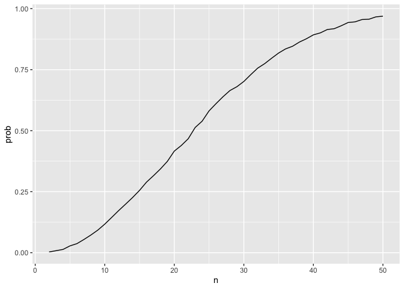
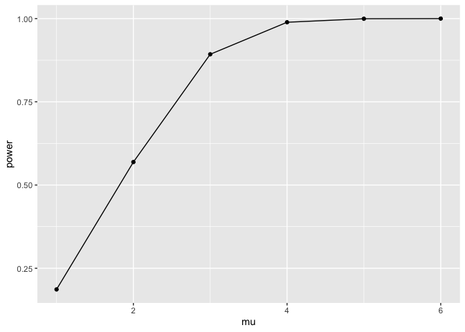

HW5 - mm6410
================
Mahdi Maktabi
2024-11-11

## Question 1

``` r
bday_sim = function(n) {
  
  bdays = sample(1:365, size = n, replace = TRUE)

  duplicate = length(unique(bdays)) < n

  return(duplicate)
  
}

bday_sim(10)
```

    ## [1] FALSE

``` r
sim_res =
  expand_grid(
    n = 2:50,
    iter = 1:10000
  ) |> 
  mutate(res = map_lgl(n, bday_sim)) |> 
  group_by(n) |> 
  summarize(prob = mean(res))

sim_res |> 
  ggplot(aes(x = n, y = prob)) +
  geom_line()
```

<!-- -->

The function and figure show the probablity that at least two people in
a room share a birthday between (n = 2 and n = 50). We can see that as
we increase the number of people in the room, the probability of the
same birthday steadily increases. When we get to 50 people, the
probability is close to 100%.

## Question 2

``` r
sim_mean_pvalue = function(n = 30, mu = 0, sigma = 5) {
  
  sim_data = tibble(
    x = rnorm(n, mean = mu, sd = sigma)
    )
  
  t_test = t.test(sim_data$x, mu = 0)
  
  tibble(
      mu_hat = mean(sim_data$x),
      p_value = broom::tidy(t_test)$p.value)
  
}

sim_mean_pvalue()
```

    ## # A tibble: 1 × 2
    ##   mu_hat p_value
    ##    <dbl>   <dbl>
    ## 1  -1.33   0.162

``` r
output = vector("list", 5000)

for (i in 1:5000) {
  output[[i]] = sim_mean_pvalue()
}

sim_results = bind_rows(output)
```

Now I want to repeat the above code for $\mu$ = {1,2,3,4,5,6}.

``` r
sim_mean_pvalue = function(n = 30, mu, sigma = 5) {
  
  sim_data = tibble(
    x = rnorm(n, mean = mu, sd = sigma)
    )
  
  t_test = t.test(sim_data$x, mu = 0)
  
  tibble(
      mu_hat = mean(sim_data$x),
      p_value = broom::tidy(t_test)$p.value)
  
}

sim_results_df = 
  expand_grid(
    mu = c(1:6),
    iter = 1:5000) |> 
  mutate(
    estimate_df = map(mu, ~ sim_mean_pvalue(30, .x))
  ) |> 
  unnest(estimate_df)
```

I will now make a plot that shows the relationship between power and
$\mu$.

``` r
sim_results_df |> 
  group_by(mu) |> 
  summarize(power = mean(p_value < 0.05)) |> 
  ggplot(aes(x = mu, y = power)) + 
  geom_point() +
  geom_line()
```

<!-- -->

This figure shows that as you increase $\mu$, power increases.
Increasing $\mu$ from 1 to 3 has the largest effect on power.

``` r
sim_results_df |> 
    group_by(mu) |> 
    summarize(
      avg_mu = mean(mu_hat),
      avg_mu_rej = mean(mu_hat[p_value < 0.05])
    ) |> 
  ggplot(aes(x = mu)) +
  geom_point(aes(y = avg_mu)) +
  geom_line(aes(y = avg_mu)) +
  geom_point(aes(y = avg_mu_rej, color = "red")) +
  geom_line(aes(y = avg_mu_rej, color = "red"))
```

<!-- -->

This figure shows that the sample average of $\hat{\mu}$ across tests
for which the null is rejected is approximately equal to $\mu$ as it
approaches 6. When $\mu$ is low, $\hat{\mu}$ is not the same but will
slowly approach the $\mu$ curve.

## Problem 3

``` r
homicides_df =
  read_csv(file = "./data/homicide-data.csv")
```

    ## Rows: 52179 Columns: 12
    ## ── Column specification ────────────────────────────────────────────────────────
    ## Delimiter: ","
    ## chr (9): uid, victim_last, victim_first, victim_race, victim_age, victim_sex...
    ## dbl (3): reported_date, lat, lon
    ## 
    ## ℹ Use `spec()` to retrieve the full column specification for this data.
    ## ℹ Specify the column types or set `show_col_types = FALSE` to quiet this message.

After importing the raw data, we see that there are:

- 52,179 observations and 12 variables (uid, reported_date, victim_last,
  victim_first, victim_race, victim_age, victim_sex, city, state, lat,
  lon, disposition)

Now I will start manipulating the dataset.

This first step will add a `city_state` column and then summarize within
cities to obtain the total number of homicides and the number of
unsolved homicides

``` r
homicides_df |> 
  mutate(
    city_state = str_c(city, state, sep = ", ")) |> 
  group_by(city_state) |> 
  summarize(
    total_homicides = n(),
    unsol_homicides = sum(disposition %in% c("Closed without arrest", "Open/No arrest"))
  )
```

    ## # A tibble: 51 × 3
    ##    city_state      total_homicides unsol_homicides
    ##    <chr>                     <int>           <int>
    ##  1 Albuquerque, NM             378             146
    ##  2 Atlanta, GA                 973             373
    ##  3 Baltimore, MD              2827            1825
    ##  4 Baton Rouge, LA             424             196
    ##  5 Birmingham, AL              800             347
    ##  6 Boston, MA                  614             310
    ##  7 Buffalo, NY                 521             319
    ##  8 Charlotte, NC               687             206
    ##  9 Chicago, IL                5535            4073
    ## 10 Cincinnati, OH              694             309
    ## # ℹ 41 more rows

I will now run a `prop.test` for the city of Balitmore, MD.

``` r
baltimore_test = homicides_df |> 
  mutate(
    city_state = str_c(city, state, sep = ", ")) |> 
  group_by(city_state) |> 
  filter(city_state == "Baltimore, MD") |> 
  summarize(
    total_homicides = n(),
    unsol_homicides = sum(disposition %in% c("Closed without arrest", "Open/No arrest"))
  )

baltimore_prop_test = 
  prop.test(
    x = baltimore_test$unsol_homicides,
    n = baltimore_test$total_homicides) |> 
  broom::tidy() |> 
  select(estimate, conf.low, conf.high)
```

Since this works, I will now repeat `prop.test` for the remaining cities
in my dataset.

``` r
city_prop_test = function(city_state) {
  

  
  city_data = homicides_df |> 
    mutate(city_state = str_c(city, state, sep = ", ")) |> 
    group_by(city_state) |> 
    filter(city_state == !!city_state) |> 
    summarize(
      total_homicides = n(),
      unsol_homicides = sum(disposition %in% c("Closed without arrest", "Open/No arrest")))
  
  
  prop_test_result = 
    prop.test(
      x = city_data$unsol_homicides,
      n = city_data$total_homicides) |> 
    broom::tidy() |> 
    select(estimate, conf.low, conf.high)
  
  return(prop_test_result)
  

}
```

Now that my function is defined, I can use `map` for each city in our
dataset.

``` r
city_results = homicides_df |> 
  mutate(city_state = str_c(city, state, sep = ", ")) |> 
  distinct(city_state) |> 
  mutate(
    prop_test_res = map(city_state, city_prop_test)) |> 
  unnest(prop_test_res)
```

    ## Warning: There was 1 warning in `mutate()`.
    ## ℹ In argument: `prop_test_res = map(city_state, city_prop_test)`.
    ## Caused by warning in `prop.test()`:
    ## ! Chi-squared approximation may be incorrect

``` r
city_results
```

    ## # A tibble: 51 × 4
    ##    city_state      estimate conf.low conf.high
    ##    <chr>              <dbl>    <dbl>     <dbl>
    ##  1 Albuquerque, NM    0.386    0.337     0.438
    ##  2 Atlanta, GA        0.383    0.353     0.415
    ##  3 Baltimore, MD      0.646    0.628     0.663
    ##  4 Baton Rouge, LA    0.462    0.414     0.511
    ##  5 Birmingham, AL     0.434    0.399     0.469
    ##  6 Boston, MA         0.505    0.465     0.545
    ##  7 Buffalo, NY        0.612    0.569     0.654
    ##  8 Charlotte, NC      0.300    0.266     0.336
    ##  9 Chicago, IL        0.736    0.724     0.747
    ## 10 Cincinnati, OH     0.445    0.408     0.483
    ## # ℹ 41 more rows

I will now plot these estimates and CIs for each city as well as
organize them according to the proportion of unsolved homicides.

``` r
city_results |> 
  arrange(estimate) |>
  mutate(city_state = factor(city_state, levels = city_state)) |>
  ggplot(aes(x = city_state, y = estimate)) +
  geom_point() +
  geom_errorbar(aes(ymin = conf.low, ymax = conf.high)) +
  theme(
    axis.text.x = element_text(angle = 45, hjust = 1)
  )
```

<!-- -->
